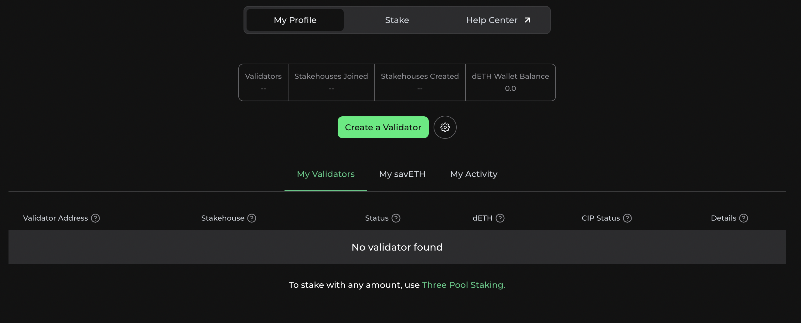

# Stakehouse Dapp

## Overview

Stakehouse Dapp allows you to interact with the the Stakehouse protocol.

For more information, please take a look at the docs: https://docs.joinstakehouse.com

## Software is provided as is

Please feel free to customize and host as best suits. This Dapp can easily serve as a whitelabelling site and method to attract ETH stake to a specific Stakehouse rather than supporting every house. There is a lot of freedom.

## Netlify Supported

Any hosting site should work but this dapp has been working on Netlify. If there are any issues hosting on other services, please open a PR by following the contribution guide below.

## Getting Started

### `npm i`

Installs the dependencies.

### `npm start`

Runs the app in the development mode.\
Open [http://localhost:3000](http://localhost:3000) to view it in the browser.

The page will reload if you make edits.\
You will also see any lint errors in the console.

### `npm run build`

Builds the app for production to the `build` folder.\
It correctly bundles React in production mode and optimizes the build for the best performance.

The build is minified and the filenames include the hashes.\
Your app is ready to be deployed!

See the section about [deployment](https://facebook.github.io/create-react-app/docs/deployment) for more information.

## Contributing

We welcome contributions to Stakehouse Dapp. If you'd like to contribute, please follow these guidelines:

1. Fork the project.
2. Create a new branch for your feature or bug fix.
3. Make your changes and commit them with clear and concise messages.
4. Push your changes to your fork.
5. Create a pull request to the main repository.

## Minting derivatives and joining selected stakehouses

If you wish to deploy and use the Dapp and allow stakers to mint derivatives only in your selected stakehouses, please follow these guidelines:

1. Fork the project.
2. Open `src/graphql/queries/tickerNames.ts`.
3. Replace `stakehouses` on line 5 with `stakehouses(where:{sETHTicker_in:[<LIST_OF_TICKERS>]})`

## License

This project is licensed under MIT - see the [LICENSE.md](./LICENSE.md) file for details.
